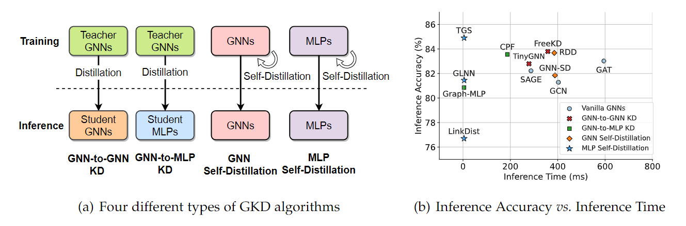

# Teacher-Free Graph Self-Distillation (TGS)


This is a PyTorch implementation of the Teacher-Free Graph Self-Distillation (TGS), and the code includes the following modules:

* Dataset Loader (Cora, Citeseer, Coauthor-CS, and Coauthor-Phy, Amazon-Com, and Amazon-Photo)

* Neighborhood Self-Distillation network (MLP-to-MLP distillation)

* Training and evaluation paradigm 

  

## Introduction

Recent years have witnessed great success in handling graph-related tasks with Graph Neural Networks (GNNs). Despite their great academic success, Multi-Layer Perceptrons (MLPs) remain the primary workhorse for practical industrial applications. One reason for such an academic-industry gap is the neighborhood-fetching latency incurred by data dependency in GNNs. To reduce their gaps, Graph Knowledge Distillation (GKD) is proposed, usually based on a standard teacher-student architecture, to distill knowledge from a large teacher GNN into a lightweight student GNN or MLP. However, we found in this paper that neither teachers nor GNNs are necessary for graph knowledge distillation. We propose a Teacher-Free Graph Self-Distillation (TGS) framework that does not require any teacher model or GNNs during both training and inference. More importantly, the proposed TGS framework is purely based on MLPs, where structural information is only implicitly used to guide dual knowledge self-distillation between the target node and its neighborhood. As a result, TGS enjoys the benefits of graph topology awareness in training but is free from data dependency in inference. Extensive experiments have shown that the performance of vanilla MLPs can be greatly improved with dual self-distillation, e.g., TGS improves over vanilla MLPs by 15.54% on average and outperforms state-of-the-art GKD algorithms on six real-world datasets. In terms of inference speed, TGS infers 75$\times$-89$\times$ faster than existing GNNs and 16$\times$-25$\times$ faster than classical inference acceleration methods. 

<p align="center">
  
</p>


## Main Requirements

* networkx==2.5
* numpy==1.19.2
* dgl==0.6.1
* torch==1.6.0


## Description

* main.py  
  * main() -- Train the model for node classification task with the proposed Neighborhood Self-Distillation module on six datasets.
* model.py  
  * MLP() -- A pure MLP-based architecture ans two prediction heads.
  * NeFactor() -- Learning interpolation coefficients for interpolation between the target node and its ineighborhood nodes.
* dataset.py  

  * dataloader() -- Load six datasets as well as their variants with different label rates and label noise.
* utils.py  
  * SetSeed() -- Set seeds for reproducible results.


## Running the code

1. Install the required dependency packages

3. To get the results on a specific *dataset*, please run with proper hyperparameters:

  ```
python main.py --dataset data_name
  ```

where the *data_name* is one of the 6 datasets (Cora, Citeseer, Coauthor-CS, and Coauthor-Phy, Amazon-Com, and Amazon-Photo). Use  *Cora* dataset an example: 

```
python main.py --dataset cora
```

3. To get the results on datasets with different label rates, label noise, and struture disturbance, please run with:

  ```
python main.py --model_mode
  ```

where the *label_mode* denotes different dataset variants. **(1) 1:** training with 5 labels per class; **(2) 2:** training with 10 labels per class; **(3) 3**: training with 10 labels per class; **(4) 11:** training with label noise ratio 10%; **(5) 12:** training with label noise ratio 20%; **(6) 13:** training with label noise ratio 30%; **(7) 14:** training with label noise ratio 40%; **(8) 15:** training with label noise ratio 50%; **(9) 16:** training with label noise ratio 60%.


## Citation

If you find this project useful for your research, please use the following BibTeX entry.

```
@article{wu2022teaching,
  title={Teaching Yourself: Graph Self-Distillation on Neighborhood for Node Classification},
  author={Wu, Lirong and Xia, Jun and Lin, Haitao and Gao, Zhangyang and Liu, Zicheng and Zhao, Guojiang and Li, Stan Z},
  journal={arXiv preprint arXiv:2210.02097},
  year={2022}
}
```